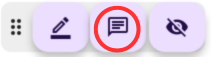

# Web Memory Sheet – Benutzerhandbuch

Diese Seite bietet eine schnelle Anleitung zur Nutzung von **Web Memory Sheet**.

## Was ist diese App?

Kennst du die klassische „rote Folie“-Methode zum Lernen?  
Man markiert wichtige Stellen und deckt sie dann mit einer roten Folie ab, um sich abzufragen.  
**Web Memory Sheet bringt diese Methode direkt auf dein Smartphone!**

Du kannst Lehrbuchseiten, Notizen oder Webseiten importieren  
und sie im Handumdrehen in digitale Lernkarten verwandeln.

Egal ob Lernwebseite oder Fotos von Schulbüchern, Notizen oder der Tafel (bitte vorher die Lehrkraft um Erlaubnis fragen) – mit wenigen Handgriffen wird daraus eine Lernkarte.

Los geht’s – so funktioniert die App:

## Inhaltsverzeichnis

- [Web Memory Sheet – Benutzerhandbuch](#web-memory-sheet--benutzerhandbuch)
  - [Was ist diese App?](#was-ist-diese-app)
  - [Inhaltsverzeichnis](#inhaltsverzeichnis)
  - [Vor der Nutzung](#vor-der-nutzung)
    - [Nutzungsbedingungen \& Datenschutz](#nutzungsbedingungen--datenschutz)
    - [Sprache ändern](#sprache-ändern)
  - [So funktioniert’s](#so-funktionierts)
    - [Webseite öffnen](#webseite-öffnen)
      - [URL eingeben](#url-eingeben)
      - [Nach Stichwort suchen](#nach-stichwort-suchen)
    - [Fotos verwenden](#fotos-verwenden)
      - [Foto aufnehmen](#foto-aufnehmen)
      - [Foto aus Galerie nutzen](#foto-aus-galerie-nutzen)
    - [Marker setzen](#marker-setzen)
      - [Marker verwenden](#marker-verwenden)
      - [Farbe und Stärke ändern](#farbe-und-stärke-ändern)
      - [Marker löschen](#marker-löschen)
      - [Lernmodus verwenden](#lernmodus-verwenden)
    - [Notizen hinzufügen](#notizen-hinzufügen)
      - [Notiz platzieren](#notiz-platzieren)
      - [Notiz verwalten / löschen](#notiz-verwalten--löschen)
    - [Favoriten nutzen](#favoriten-nutzen)
      - [Als Favorit speichern](#als-favorit-speichern)
      - [Favoriten öffnen](#favoriten-öffnen)
    - [Symbolleiste verschieben](#symbolleiste-verschieben)
      - [Leiste verschieben](#leiste-verschieben)

---

## Vor der Nutzung

### Nutzungsbedingungen & Datenschutz

Beim ersten Start der App musst du Folgendes tun:

1. Nutzungsbedingungen öffnen, ganz lesen → Häkchen setzen  
2. Datenschutzrichtlinien öffnen, ganz lesen → Häkchen setzen  
3. Sobald beide Häkchen aktiv sind, wird der „Zustimmen“-Button verfügbar  

Danach ist die App einsatzbereit.

> **Hinweis**  
> Diese Texte erklären, wie du die App nutzt und wie mit deinen Daten umgegangen wird.  
> Bitte aufmerksam lesen und zustimmen!  
> (Im Demo-Video wird es übersprungen, aber du solltest es wirklich lesen!)  
> Auch hier verfügbar:  
> [Nutzungsbedingungen](./pp/privacyPolicy_ja.html)  
> [Datenschutzrichtlinie](./pp/userAgreement_ja.html)

### Sprache ändern

1. Auf das Globus-Symbol oben rechts tippen  
2. Gewünschte Sprache auswählen  

*Hinweis: Externe Webseiten werden dadurch **nicht** übersetzt.*

---

## So funktioniert’s

### Webseite öffnen

Die App fungiert wie ein normaler Browser – gib eine URL ein oder suche nach Inhalten!

#### URL eingeben

1. Adressleiste antippen  
2. URL eingeben  
3. Auf Lupe oder Enter tippen  

#### Nach Stichwort suchen

1. Adressleiste antippen  
2. Suchbegriff eingeben  
3. Website aus den Suchergebnissen auswählen  

> **Achtung**  
> Manche Webseiten (wie PDFs, animierte Inhalte oder Videoportale) werden **nicht** unterstützt.

---

### Fotos verwenden

Auch Fotos vom Smartphone lassen sich nutzen!

#### Foto aufnehmen

1. Kamera-Symbol neben der Adresse antippen  
2. **Kamera**-Symbol wählen  
3. Foto machen  
4. Bild wird angezeigt  
5. Bildgröße über Schieberegler oben links anpassen  

#### Foto aus Galerie nutzen

1. Wieder Kamera-Symbol antippen  
2. **Foto**-Symbol wählen  
3. Bild aus der Galerie auswählen  
4. Bildgröße über Schieberegler anpassen  

---

### Marker setzen

Wenn Foto oder Webseite angezeigt wird, kannst du loslegen!

#### Marker verwenden

1. Unten auf das Stift-Symbol tippen  
     
2. Mit dem Finger über den Bereich ziehen, den du abdecken möchtest  
   

#### Farbe und Stärke ändern

1. Stift-Symbol erneut antippen  
2. Auf das Farbrad-Symbol tippen  
     
3. Im Dialog:
   - **Farbe** links auswählen  
   - **Stärke** über den rechten Schieberegler einstellen  
4. „OK“ tippen  

#### Marker löschen

1. Den Marker antippen  
2. Wenn hervorgehoben, das Mülltonnen-Symbol tippen  
     
   

#### Lernmodus verwenden

1. Auf das „verstecken“-Auge tippen → Marker wird undurchsichtig  
     
2. Mit dem Finger darüberziehen, um den Text sichtbar zu machen  
3. Auf den Marker tippen, um eine temporäre Notiz zu schreiben (verschwindet beim Verlassen des Modus)  
4. Auf das „Auge“-Symbol tippen, um zur durchsichtigen Ansicht zurückzukehren  
     
   

---

### Notizen hinzufügen

Du kannst auch Haftnotizen setzen!

#### Notiz platzieren

1. Unten das Notiz-Symbol antippen  
     
2. Bereich antippen, wo die Notiz erscheinen soll  
3. Farbe wählen, Text eingeben → „OK“ tippen  

#### Notiz verwalten / löschen

1. Notiz antippen → Inhalt öffnen  
     
2. Farbe ändern → Farbsymbol antippen  
     
3. Text bearbeiten → Stift-Symbol tippen  
     
4. Löschen → Mülltonnen-Symbol antippen  
   

---

### Favoriten nutzen

Webseiten mit Markern oder Notizen lassen sich als Favoriten speichern – inklusive Inhalt!

**Einmal gespeichert, werden folgende Änderungen automatisch übernommen.**

#### Als Favorit speichern

1. Unten auf das Herz-Symbol tippen  
     
2. Ordner wählen, Titel eingeben → „Hinzufügen“ tippen  

#### Favoriten öffnen

1. Herz-Symbol erneut tippen → Favoritenliste erscheint  
     
2. Den gewünschten Eintrag antippen  

---

### Symbolleiste verschieben

Die Symbolleiste unten rechts lässt sich frei verschieben.  

#### Leiste verschieben

1. Linken Rand der Leiste gedrückt halten und ziehen  
2. An gewünschter Stelle loslassen – fertig!  

