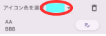

# Web Memory Sheet - User Guide

This page provides a simple guide on how to use **Web Memory Sheet**.

## What is this app?

Are you familiar with the classic "red sheet" memorization method used by students?  
It’s the one where you use a red transparent sheet to hide highlighted text and test your memory.  
**Web Memory Sheet is an app that brings that method to your smartphone!**

You can turn textbooks, notebooks, and educational websites into digital memory sheets—quick and easy.

You can use educational websites, photos of your textbooks or notebooks (please get permission from your teacher if needed), and turn them into memory sheets with just a few taps.

Let’s get started with how to use the app.

## Table of Contents

- [Web Memory Sheet - User Guide](#web-memory-sheet---user-guide)
  - [What is this app?](#what-is-this-app)
  - [Table of Contents](#table-of-contents)
  - [Before You Start](#before-you-start)
    - [Terms of Use \& Privacy Policy](#terms-of-use--privacy-policy)
    - [Change the Language](#change-the-language)
  - [How to Use](#how-to-use)
    - [Open a Website](#open-a-website)
      - [Enter a URL](#enter-a-url)
      - [Search by Keyword](#search-by-keyword)
    - [Use Photos](#use-photos)
      - [Take a Photo](#take-a-photo)
      - [Use a Saved Photo](#use-a-saved-photo)
    - [Use the Marker](#use-the-marker)
      - [Add a Marker](#add-a-marker)
      - [Change Color or Thickness](#change-color-or-thickness)
      - [Delete a Marker](#delete-a-marker)
      - [Use Memorization Mode](#use-memorization-mode)
    - [Add Notes](#add-notes)
      - [Add a Note](#add-a-note)
      - [View / Edit / Delete a Note](#view--edit--delete-a-note)
    - [Use Favorites](#use-favorites)
      - [Register as Favorite](#register-as-favorite)
      - [Open from Favorites](#open-from-favorites)
    - [Move the Icon Panel](#move-the-icon-panel)
      - [Move the Panel](#move-the-panel)

---

## Before You Start

### Terms of Use & Privacy Policy

The first time you launch the app, you'll need to:

1. Open and read the **Terms of Use** to the end → Check the box  
2. Open and read the **Privacy Policy** to the end → Check the box  
3. Once both boxes are checked, the “Agree” button becomes clickable  

After that, the app will be ready to use.

> **Note**  
> These documents explain the rules for using the app and how it handles data collected from your device.  
> Please read them carefully and agree.  
> (The video below skips reading for brevity, but make sure you read it thoroughly!)  
> You can also view them here:  
> [Terms of Use](./pp/privacyPolicy_en.html)  
> [Privacy Policy](./ua/userAgreement_en.html)

### Change the Language

1. Tap the globe icon at the top right  
2. Select your preferred language!  

*Note: This does not change the language of websites.*

---

## How to Use

### Open a Website

This app works like a standard web browser.  
You can enter a URL or search for content!

#### Enter a URL

1. Tap the address bar  
2. Type the URL  
3. Tap the magnifying glass or press Enter  

#### Search by Keyword

1. Tap the address bar  
2. Enter the keyword  
3. Tap a link from the search results  

> **Warning**  
> Some websites (like interactive content, PDFs, or video sites) may not be supported.

---

### Use Photos

Not just websites—you can also use your camera or saved images!

#### Take a Photo

1. Tap the camera icon next to the address bar  
2. Tap the **Camera** icon  
3. Take a picture  
4. The photo will appear on-screen  
5. Use the top-left bar to adjust image size  

#### Use a Saved Photo

1. Tap the same camera icon  
2. Tap the **Photo** icon  
3. Select an image from your device  
4. Adjust the size using the top-left bar  

---

### Use the Marker

Once your photo or webpage is displayed, you can start marking!

#### Add a Marker

1. Tap the pen icon at the bottom  
  
2. Drag your finger over the part you want to hide  

#### Change Color or Thickness

1. Tap the pen icon  
2. Tap the palette icon  
  
3. Adjust:  
   - **Color**: left side  
   - **Thickness**: right slider  
4. Tap OK  

#### Delete a Marker

1. Tap the marker you want to delete  
2. When highlighted, tap the trash icon  
  

#### Use Memorization Mode

1. Tap the hidden-eye icon → markers become opaque  
  
2. Swipe to reveal hidden text  
3. Tap a marker to add a temporary note (disappears when the mode ends)  
4. Tap the eye icon to restore transparency  
  

---

### Add Notes

You can add sticky notes too!

#### Add a Note

1. Tap the note icon at the bottom  
  
2. Tap the spot you want to place a note  
3. Choose a color, write your note → Tap OK  

#### View / Edit / Delete a Note

1. Tap the note to open it  
  
2. Change color → tap the color icon  
  
3. Edit → tap the pencil icon  
  
4. Delete → tap the trash icon  

---

### Use Favorites

If you register a page with markers or notes as a favorite, you can restore them later!  
**Once registered, future changes are auto-saved.**

#### Register as Favorite

1. Tap the heart icon at the bottom  
  
2. Choose a folder, enter a title → Tap “Add”  

#### Open from Favorites

1. Tap the heart icon again → A list appears  
  
2. Tap the item you want to open  

---

### Move the Icon Panel

The icon panel at the bottom right can be moved freely.  

#### Move the Panel

1. Drag the left edge of the panel  
2. Release at the desired position  

