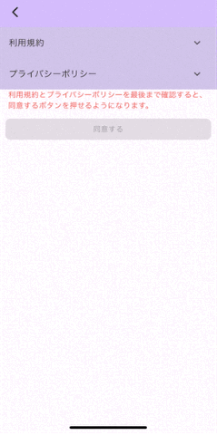
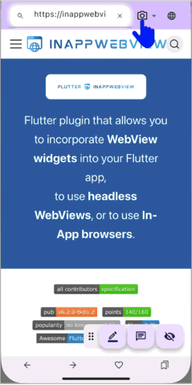
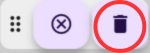
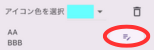
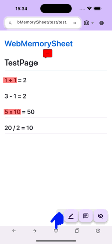

# Web Memory Sheet – Guía de uso

Esta página ofrece una guía sencilla para utilizar **Web Memory Sheet**.

## ¿Qué es esta app?

¿Conoces la clásica técnica de estudio con "hoja roja"?  
Se subrayan los textos importantes y se tapan con una hoja roja para practicar la memoria.  
**Web Memory Sheet lleva ese método a tu smartphone.**

Importa páginas de manuales, apuntes o sitios educativos  
y transfórmalos en fichas de repaso digitales al instante.

Tanto un sitio web educativo como fotos de libros, apuntes o la pizarra (pide permiso al profesor)  
pueden convertirse en fichas de memoria con unos toques.

Así es como funciona:

## Índice

- [Web Memory Sheet – Guía de uso](#web-memory-sheet--guía-de-uso)
  - [¿Qué es esta app?](#qué-es-esta-app)
  - [Índice](#índice)
  - [Antes de empezar](#antes-de-empezar)
    - [Términos de uso y privacidad](#términos-de-uso-y-privacidad)
    - [Cambiar de idioma](#cambiar-de-idioma)
  - [Cómo usarla](#cómo-usarla)
    - [Abrir un sitio web](#abrir-un-sitio-web)
      - [Escribir una URL](#escribir-una-url)
      - [Búsqueda por palabra clave](#búsqueda-por-palabra-clave)
    - [Usar fotos](#usar-fotos)
      - [Tomar una foto](#tomar-una-foto)
      - [Elegir una foto guardada](#elegir-una-foto-guardada)
    - [Usar el marcador](#usar-el-marcador)
      - [Colocar un marcador](#colocar-un-marcador)
      - [Cambiar color y grosor](#cambiar-color-y-grosor)
      - [Eliminar un marcador](#eliminar-un-marcador)
      - [Modo de memorizar](#modo-de-memorizar)
    - [Agregar notas](#agregar-notas)
      - [Añadir una nota](#añadir-una-nota)
      - [Ver / editar / eliminar](#ver--editar--eliminar)
    - [Usar favoritos](#usar-favoritos)
      - [Guardar como favorito](#guardar-como-favorito)
      - [Abrir favoritos](#abrir-favoritos)
    - [Mover el panel de iconos](#mover-el-panel-de-iconos)
      - [Cómo moverlo](#cómo-moverlo)

---

## Antes de empezar

### Términos de uso y privacidad

La primera vez que abras la app, deberás:

1. Abrir los **Términos de uso**, leerlos hasta el final y marcar la casilla  
2. Abrir la **Política de privacidad**, leerla y marcar la casilla  
3. Una vez marcadas ambas, el botón “Aceptar” se habilita  

Luego ya podrás usar la app.

> **Nota**  
> Estos documentos explican las normas de uso y el tratamiento de datos.  
> Léelos con atención y acepta.  
> (En el vídeo suelen pasarlos por alto, pero es importante leerlos.)  
> También disponibles aquí:  
> [Términos de uso](./pp/privacyPolicy_ja.html)  
> [Política de privacidad](./pp/userAgreement_ja.html)

---

### Cambiar de idioma

1. Toca el icono del globo en la esquina superior derecha  
2. Selecciona tu idioma preferido  

*Nota: esto no modifica el idioma de los sitios web.*

---

## Cómo usarla

### Abrir un sitio web

La app funciona como un navegador: escribe una URL o busca contenido.

#### Escribir una URL

1. Toca la barra de dirección  
2. Escribe la URL  
3. Toca la lupa o pulsa Enter  

#### Búsqueda por palabra clave

1. Toca la barra de dirección  
2. Ingresa una palabra clave  
3. Toca un resultado de la búsqueda  

> **Atención**  
> Algunos sitios (PDF, contenido dinámico, videos) podría no estar soportados.

---

### Usar fotos

También puedes usar la cámara o imágenes guardadas del dispositivo.

#### Tomar una foto

1. Toca el icono de cámara junto a la URL  
2. Selecciona **Cámara**  
3. Toma la foto  
4. La imagen se mostrará en pantalla  
5. Ajusta el tamaño usando el deslizador superior izquierdo  

#### Elegir una foto guardada

1. Toca el icono de cámara de nuevo  
2. Selecciona **Fotos**  
3. Elige una imagen del dispositivo  
4. Ajusta el tamaño si lo deseas  

---

### Usar el marcador

Cuando la foto o página web esté visible, puedes cubrir lo importante.

#### Colocar un marcador

1. Toca el icono de lápiz en la parte inferior  
     
2. Arrastra el dedo sobre el texto que quieres ocultar  
   

#### Cambiar color y grosor

1. Toca nuevamente el lápiz  
2. Selecciona el icono de paleta  
     
3. Ajusta:  
   - **Color** (lado izquierdo)  
   - **Grosor** (deslizador derecho)  
4. Pulsa **OK**  

#### Eliminar un marcador

1. Toca el marcador que quieres borrar  
2. Cuando esté resaltado, toca el icono de papelera  
     
   

#### Modo de memorizar

1. Toca el icono de ojo tachado → el marcador se vuelve opaco  
     
2. Desliza para revelar lo oculto  
3. Toca un marcador para agregar una nota temporal (desaparece al salir del modo)  
4. Toca nuevamente el icono de ojo para volver  
     
   

---

### Agregar notas

También puedes colocar notas adhesivas.

#### Añadir una nota

1. Toca el icono de nota en la parte inferior  
     
2. Toca donde quieres colocarla  
3. Elige el color, escribe la nota y pulsa **OK**  

#### Ver / editar / eliminar

1. Toca la nota para abrirla  
     
2. Cambia el color tocando el icono de color  
     
3. Edita el texto tocando el icono de lápiz  
     
4. Borra la nota con el icono de papelera  
   

---

### Usar favoritos

Si guardas una página con marcadores o notas como favorita, puedes recuperarla más tarde.  
**Al guardar, todos los cambios posteriores se guardan automáticamente.**

#### Guardar como favorito

1. Toca el icono de corazón en la parte inferior  
     
2. Selecciona una carpeta, ingresa un título y pulsa **Añadir**  

#### Abrir favoritos

1. Toca de nuevo el corazón → se abre la lista  
     
2. Selecciona el elemento deseado  

---

### Mover el panel de iconos

El panel de iconos en la esquina inferior derecha se puede mover libremente.  

#### Cómo moverlo

1. Mantén pulsado el borde izquierdo del panel y arrástralo  
2. Suelta el dedo donde quieras colocar el panel  

