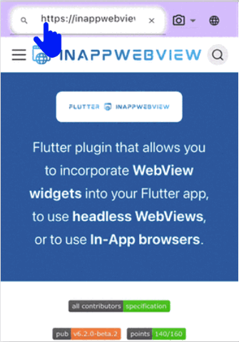
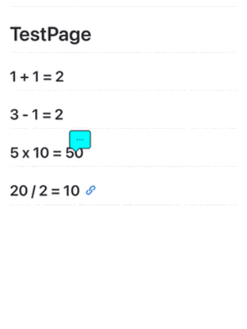
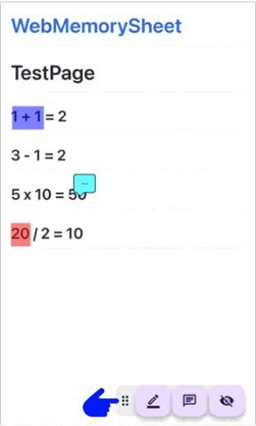

# Web Memory Sheet – Guide d’utilisation

Cette page propose un guide simple pour utiliser **Web Memory Sheet**.

## Qu’est‑ce que cette application ?

Connaissez‑vous la méthode d’apprentissage sur feuille rouge ?  
On surligne un texte, puis on le cache avec une feuille rouge pour tester sa mémoire.  
**Web Memory Sheet reproduit cette méthode sur votre smartphone !**

Importez des pages de manuels, des notes ou des sites pédagogiques  
et transformez-les en fiches de révision numériques en un clin d’œil.

Que ce soit un site web éducatif, une photo de manuel, de notes ou de tableau (avec permission du professeur), tout devient fiche de révision.

Voici comment ça fonctionne :

## Sommaire

- [Web Memory Sheet – Guide d’utilisation](#web-memory-sheet--guide-dutilisation)
  - [Qu’est‑ce que cette application ?](#questce-que-cette-application)
  - [Sommaire](#sommaire)
  - [Avant de commencer](#avant-de-commencer)
    - [Conditions d’utilisation \& Confidentialité](#conditions-dutilisation--confidentialité)
    - [Changer la langue](#changer-la-langue)
  - [Comment ça marche](#comment-ça-marche)
    - [Ouvrir un site web](#ouvrir-un-site-web)
      - [Entrer une URL](#entrer-une-url)
      - [Recherche par mot-clé](#recherche-par-mot-clé)
    - [Utiliser des photos](#utiliser-des-photos)
      - [Prendre une photo](#prendre-une-photo)
      - [Choisir une photo](#choisir-une-photo)
    - [Placer un marqueur](#placer-un-marqueur)
      - [Ajouter un marqueur](#ajouter-un-marqueur)
      - [Modifier couleur ou épaisseur](#modifier-couleur-ou-épaisseur)
      - [Supprimer un marqueur](#supprimer-un-marqueur)
      - [Mode memorisation](#mode-memorisation)
    - [Ajouter des notes](#ajouter-des-notes)
      - [Poser une note](#poser-une-note)
      - [Gérer / modifier / supprimer](#gérer--modifier--supprimer)
    - [Utiliser les favoris](#utiliser-les-favoris)
      - [Ajouter aux favoris](#ajouter-aux-favoris)
      - [Ouvrir un favori](#ouvrir-un-favori)
    - [Déplacer le panneau d’icônes](#déplacer-le-panneau-dicônes)
      - [Comment déplacer](#comment-déplacer)

---

## Avant de commencer

### Conditions d’utilisation & Confidentialité

À la première ouverture, vous devez :

1. Ouvrir les **Conditions d’utilisation**, lire et cocher la case  
2. Ouvrir la **Politique de confidentialité**, lire et cocher  
3. Le bouton « Accepter » devient actif

Ensuite, l’app est prête à l’emploi.

> **Note**  
> Ces documents expliquent les règles d’utilisation et le traitement des données.  
> Lisez-les attentivement et acceptez-les.  
> (La vidéo passe souvent outre, mais merci de les consulter !)  
> Vous pouvez aussi les consulter ici :  
> [Conditions d’utilisation](./pp/privacyPolicy_ja.html)  
> [Politique de confidentialité](./pp/userAgreement_ja.html)

---

### Changer la langue

1. Touchez l’icône du globe en haut à droite  
2. Sélectionnez votre langue préférée  

*Note : cela ne modifie pas la langue des sites web.*

---

## Comment ça marche

### Ouvrir un site web

L'app fonctionne comme un navigateur : entrez une URL ou cherchez un contenu.

#### Entrer une URL

1. Touchez la barre d’adresse  
2. Tapez l’URL  
3. Touchez la loupe ou appuyez sur Entrée  

#### Recherche par mot-clé

1. Touchez la barre d’adresse  
2. Saisissez un mot-clé  
3. Touchez un résultat  

> **Attention**  
> Certains sites (fichiers PDF, contenus dynamiques, sites vidéo…) peuvent ne pas être supportés.

---

### Utiliser des photos

Vous pouvez également utiliser l'appareil photo ou des images enregistrées.

#### Prendre une photo

1. Touchez l’icône appareil photo à côté de l’URL  
2. Touchez **Appareil photo**  
3. Prenez la photo  
4. L’image s’affiche  
5. Ajustez la taille avec le curseur en haut à gauche  

#### Choisir une photo

1. Touchez l’icône appareil photo  
2. Touchez **Photos**  
3. Sélectionnez une image  
4. Ajustez la taille  

---

### Placer un marqueur

Dès que la page ou photo s’affiche, vous pouvez placer un marqueur !

#### Ajouter un marqueur

1. Touchez l’icône stylo en bas  
     
2. Tracez un surlignage sur la zone à cacher  
   

#### Modifier couleur ou épaisseur

1. Touchez l’icône stylo  
2. Touchez l’icône palette  
     
3. Réglez :  
   - **Couleur** : à gauche  
   - **Épaisseur** : curseur à droite  
4. Touchez **OK**  

#### Supprimer un marqueur

1. Touchez le marqueur  
2. Quand il est sélectionné, touchez l’icône corbeille  
     
   

#### Mode memorisation

1. Touchez l’icône œil barré → le marqueur devient opaque  
     
2. Faites glisser pour révéler le texte caché  
3. Touchez un marqueur pour ajouter une note temporaire (disparait à la fin du mode)  
4. Touchez l’icône œil normal pour revenir  
     
   

---

### Ajouter des notes

Vous pouvez également placer des notes adhésives !

#### Poser une note

1. Touchez l’icône note en bas  
     
2. Touchez l’endroit où poser la note  
3. Choisissez la couleur, tapez la note → touchez **OK**  

#### Gérer / modifier / supprimer

1. Touchez la note pour l’ouvrir  
     
2. Modifier la couleur → icône couleur  
     
3. Modifier le texte → icône crayon  
     
4. Supprimer → icône corbeille  
   

---

### Utiliser les favoris

Enregistrez une page avec marqueurs/notes en favori pour la réouvrir plus tard.  
**Après enregistrement, les modifications sont sauvegardées automatiquement.**

#### Ajouter aux favoris

1. Touchez l’icône cœur en bas  
     
2. Choisissez un dossier, saisissez un titre → touchez **Ajouter**  

#### Ouvrir un favori

1. Touchez à nouveau l’icône cœur → liste des favoris  
     
2. Touchez l’élément souhaité  

---

### Déplacer le panneau d’icônes

Le panneau situé en bas à droite peut être déplacé librement.  

#### Comment déplacer

1. Faites glisser le bord gauche du panneau  
2. Relâchez à l’emplacement souhaité  

