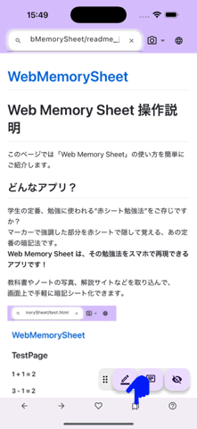

# Web Memory Sheet 操作説明

このページでは「Web Memory Sheet」の使い方を簡単にご紹介します。

## どんなアプリ？

学生の定番、勉強に使われる“赤シート勉強法”をご存じですか？  
マーカーで強調した部分を赤シートで隠して覚える、あの定番の暗記法です。  
**Web Memory Sheet は、その勉強法をスマホで再現できるアプリです！**  

教科書やノートの写真、解説サイトなどを取り込んで、  
画面上で手軽に暗記シート化できます。

インターネット上にある勉強したい科目の解説サイトや、カメラで撮影した教科書やノートや黒板（※先生の許可を得てください）の写真を、簡単な操作でそのまま暗記シートにできます。

それでは、本アプリの使い方を説明していきます。  

## 目次

* [利用前の確認事項](#利用前の確認事項)
  * [利用規約とプライバシーポリシー](#利用規約とプライバシーポリシー)
  * [言語を変える](#言語を変える)
* [操作方法](#操作方法)
  * [Webサイトを開く](#webサイトを開く)
  * [写真を使う](#写真を使う)
  * [マーカーを使う](#マーカーを使う)
  * [メモをする](#メモをする)
  * [お気に入りを使う](#お気に入りを使う)
  * [アイコンパネルの場所を変える](#アイコンパネルの場所を変える)

## 利用前の確認事項

### 利用規約とプライバシーポリシー

最初の1回だけ、以下の2つを確認して同意が必要です。

1. **利用規約** を開いて最後まで読む → チェックをつける
2. **プライバシーポリシー** を開いて最後まで読む → チェックをつける
3. 2つのチェックがつくと「同意する」ボタンが押せるようになります

その後、アプリが使えるようになります。

> [!NOTE]
> 本アプリを使う上で守っていただきたいことや、スマホ等から得た情報の取り扱いについて記載しています。よく確認して同意してください。  
> （※下の動画では読み飛ばしていますが、みなさんはちゃんと確認してくださいね）
> 以下リンクからも確認ができます。  
> [利用規約](./pp/privacyPolicy_ja.html)  
> [プライバシーポリシー](./ua/userAgreement_ja.html)

### 言語を変える

1. 画面右上の「地球マーク」をタップ  
2. 言語を選ぶだけ！

※Webサイトの言語までは変わりません。  

## 操作方法

### Webサイトを開く

このアプリ、見た目は「普通のブラウザ」です。  
URLを入れてもいいし、検索してもOK！

#### URLを直接入力
1. アドレスバーをタップ  
2. URLを入力  
3. 虫眼鏡ボタン or Enter！  

#### キーワード検索
1. アドレスバーをタップ  
2. 調べたい言葉を入力  
3. 検索結果からサイトを開こう！  

> [!WARNING]
> 一部のWebサイト（動きのあるサイト、PDF、動画サイトなど）は非対応です。

### 写真を使う

Webサイトだけじゃありません！  
スマホのカメラや保存した画像でもマーカーが使えます。

#### カメラで写真を撮る
1. アドレスバー横のカメラアイコンをタップ
2. 「カメラ」のアイコンをタップ
3. カメラが起動 → 撮影！
4. 撮った写真が画面に表示されます
5. 左上のバーで画像サイズを調整できます  

#### 保存されている写真を選ぶ
1. 同じくカメラアイコンをタップ
2. 「写真」のアイコンをタップ
3. スマホ内の画像一覧から選択
4. 左上のバーで画像サイズを調整できます  

### マーカーを使う

写真やWebサイトを表示したら、マーカーを引いて暗記スタート！

#### マーカーを引く
1. 画面下のペンアイコンをタップ  
   
2. 隠したい部分を指でなぞってドラッグ！
   

#### 色や太さを変える
1. ペンアイコンをタップ
2. パレットアイコンをタップ  
   
3. 出てきたパネルで色・太さを調整
   - 色は左側
   - 太さは右側のスライダー
4. OKで設定完了！  
   

#### マーカーを消す
1. 消したいマーカーをタップ
2. マーカーが強調されて表示されたら、ゴミ箱アイコンをタップ  
     
   

#### 暗記モードを使う
1. 目隠しアイコンをタップ → マーカーが不透明になり隠れます  
   
2. マーカーを指で引っ張ると、隠れた部分を確認できます
3. マーカーをタップするとメモも書けます  
  （※暗記中のメモなので、暗記モードが終了すると消えます）
4. 目のアイコンをタップ → 半透明に戻ります  
     
   

### メモをする

マーカーだけでなく、メモも貼れます！

#### メモを貼る
1. 画面下のメモアイコンをタップ  
   
2. メモを貼りたい場所をタップ
3. 色を選び、メモを記入 → OKで完了！  
   

#### メモを確認・編集・削除する
1. 貼ったメモをタップ → 貼り付けたメモが開きます  
  
2. 色変更：色アイコンをタップ  
  
3. メモ編集：鉛筆アイコンをタップ  
  
4. 削除：ゴミ箱アイコンをタップ  
  

### お気に入りを使う

マーカーやメモを付けたWebサイトは「お気に入り」に登録しておくと、マーカーやメモを復元できて便利です。  
**一度お気に入り登録すれば、その後はマーカーやメモも自動で保存されます**

#### お気に入り登録する
1. 画面下のハートアイコンをタップ  
  
2. フォルダを選び、タイトルを入力 → 「追加」ボタンをタップ！
  

#### お気に入りを開く
1. 画面下のお気に入りアイコンをタップ → 登録済み一覧が開きます  
  
2. 表示したい項目をタップ！  
  

### アイコンパネルの場所を変える

この画面右下のアイコンパネルは、好きな場所に動かせます。
 

#### パネルを移動する
1. パネル左端をドラッグ  
2. 好きな場所で指を離すと移動完了！  
  

