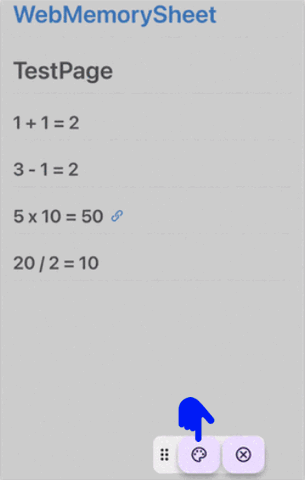
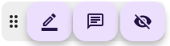

# Web Memory Sheet 사용 가이드

이 페이지에서는 **Web Memory Sheet** 앱 사용 방법을 간단히 설명합니다.

## 앱 소개

학생들 사이에서 인기 있는 ‘빨간 시트 암기법’을 아시나요?  
중요한 부분을 형광펜으로 표시한 뒤 빨간 시트로 가려 기억을 확인하는 방법인데요,  
**Web Memory Sheet는 이 방법을 스마트폰에서 구현한 앱입니다!**

교과서, 노트, 교육용 웹사이트 등을 디지털 암기 시트로 빠르게 전환할 수 있어요.

수업 자료, 노트 사진, 칠판 모습(교사의 허가 필요할 수 있음)을 몇 번의 터치로 암기 시트로 바꿀 수 있습니다.

아래에서 앱 사용 방법을 안내합니다.

## 목차

- [Web Memory Sheet 사용 가이드](#web-memory-sheet-사용-가이드)
  - [앱 소개](#앱-소개)
  - [목차](#목차)
  - [시작 전 확인사항](#시작-전-확인사항)
    - [이용약관 및 개인정보취급방침](#이용약관-및-개인정보취급방침)
    - [언어 변경하기](#언어-변경하기)
  - [앱 사용법](#앱-사용법)
    - [웹사이트 열기](#웹사이트-열기)
      - [URL 입력하기](#url-입력하기)
      - [검색어로 찾기](#검색어로-찾기)
    - [사진 사용하기](#사진-사용하기)
      - [사진 찍기](#사진-찍기)
      - [사진 선택하기](#사진-선택하기)
    - [마커 기능 사용하기](#마커-기능-사용하기)
      - [마커로 강조하기](#마커로-강조하기)
      - [색상 및 두께 변경하기](#색상-및-두께-변경하기)
      - [마커 삭제하기](#마커-삭제하기)
      - [암기 모드 사용하기](#암기-모드-사용하기)
    - [메모 추가하기](#메모-추가하기)
      - [메모 붙이기](#메모-붙이기)
      - [메모 확인/수정/삭제](#메모-확인수정삭제)
    - [즐겨찾기 사용하기](#즐겨찾기-사용하기)
      - [즐겨찾기 등록](#즐겨찾기-등록)
      - [즐겨찾기 열기](#즐겨찾기-열기)
    - [아이콘 패널 이동하기](#아이콘-패널-이동하기)
      - [이동 방법](#이동-방법)

---

## 시작 전 확인사항

### 이용약관 및 개인정보취급방침

앱을 최초 실행하면, 아래 두 가지에 동의해야 합니다:

1. **이용약관**을 열어 끝까지 읽고 체크합니다  
2. **개인정보취급방침**을 열어 끝까지 읽고 체크합니다  
3. 두 항목 모두 체크하면 “동의” 버튼이 활성화됩니다

이후 앱을 사용할 수 있습니다.

> **참고**  
> 이 문서들은 앱 이용 시 주의사항과 수집된 정보를 어떻게 사용하는지를 설명하고 있습니다.  
> 반드시 확인하고 동의해주세요.  
> (데모 영상은 건너뛸 수 있지만, 사용자는 꼭 확인해야 합니다.)  
> 아래 링크에서도 볼 수 있습니다:  
> [이용약관](./pp/privacyPolicy_ko.html)  
> [개인정보취급방침](./ua/userAgreement_ko.html)

---

### 언어 변경하기

1. 화면 우측 상단의 지구본 아이콘을 탭합니다  
2. 원하는 언어를 선택하세요!

※ 외부 웹사이트 언어는 변경되지 않습니다.

---

## 앱 사용법

### 웹사이트 열기

이 앱은 일반 브라우저처럼 사용할 수 있습니다.  
URL 입력 또는 검색어 입력으로 웹사이트를 열 수 있어요!

#### URL 입력하기

1. 주소 입력창을 탭합니다  
2. URL을 입력합니다  
3. 돋보기 아이콘을 탭하거나 Enter 키를 누릅니다  

#### 검색어로 찾기

1. 주소 입력창을 탭합니다  
2. 검색어를 입력합니다  
3. 검색 결과에서 원하는 사이트를 탭합니다  

> **경고**  
> 일부 웹사이트(애니메이션, PDF 문서, 동영상 사이트 등)는 지원되지 않을 수 있습니다.

---

### 사진 사용하기

웹사이트뿐만 아니라 카메라나 저장된 이미지도 활용할 수 있습니다!

#### 사진 찍기

1. 주소 창 옆의 카메라 아이콘을 탭합니다  
2. **카메라** 아이콘을 선택합니다  
3. 사진을 촬영합니다  
4. 촬영된 사진이 화면에 표시됩니다  
5. 왼쪽 상단의 슬라이더로 이미지 크기를 조정합니다  

#### 사진 선택하기

1. 카메라 아이콘을 다시 탭합니다  
2. **사진** 아이콘을 선택합니다  
3. 기기에서 이미지를 선택합니다  
4. 왼쪽 상단의 슬라이더로 이미지 크기를 조정합니다  

---

### 마커 기능 사용하기

웹사이트나 사진이 화면에 표시되면, 마커 기능을 사용해보세요!

#### 마커로 강조하기

1. 하단 메뉴에서 펜 아이콘을 탭합니다  
     
2. 숨기고 싶은 부분을 손가락으로 드래그하여 표시합니다  
   

#### 색상 및 두께 변경하기

1. 펜 아이콘을 다시 탭합니다  
2. 팔레트 아이콘을 탭합니다  
     
3. 설정 화면에서:
   - **색상** 왼쪽에서 선택  
   - **두께** 오른쪽 슬라이더로 조정  
4. “확인” 버튼을 탭합니다  
   

#### 마커 삭제하기

1. 삭제하려는 마커를 탭합니다  
2. 강조 표시되면 휴지통 아이콘을 탭합니다  
     
   

#### 암기 모드 사용하기

1. 눈 가린 아이콘을 탭합니다 → 마커가 불투명해지며 내용이 가려집니다  
     
2. 가려진 부분을 손가락으로 드래그하면 확인할 수 있습니다  
3. 마커를 탭하면 임시 메모를 추가할 수 있습니다 (암기 모드 종료 시 사라짐)  
4. 눈 아이콘을 다시 탭하면 반투명 상태로 돌아갑니다  
     
   

---

### 메모 추가하기

화면 어디에든 메모를 붙일 수 있습니다!

#### 메모 붙이기

1. 하단 메뉴에서 메모 아이콘을 탭합니다  
     
2. 메모를 붙이고 싶은 지점을 탭합니다  
3. 색상 선택 후 메모 내용을 입력하고 “확인” 버튼을 탭합니다  
   

#### 메모 확인/수정/삭제

1. 붙인 메모를 탭하여 엽니다  
     
2. 색상을 변경하려면 색상 아이콘을 탭합니다  
     
3. 메모 내용을 수정하려면 연필 아이콘을 탭합니다  
     
4. 메모를 삭제하려면 휴지통 아이콘을 탭합니다  
   

---

### 즐겨찾기 사용하기

마커나 메모가 있는 페이지를 즐겨찾기에 저장하면, 다음에 쉽게 복원할 수 있습니다.  
**한번 즐겨찾기하면 이후 내용도 자동으로 저장됩니다.**

#### 즐겨찾기 등록

1. 하단 메뉴에서 하트 아이콘을 탭합니다  
     
2. 폴더를 선택하고 제목 입력 후 “추가” 버튼을 탭합니다  
   

#### 즐겨찾기 열기

1. 다시 하트 아이콘을 탭하면, 저장된 즐겨찾기 목록이 표시됩니다  
     
2. 보고 싶은 항목을 탭하세요  
   

---

### 아이콘 패널 이동하기

우측 하단의 아이콘 패널은 자유롭게 이동할 수 있습니다.  

#### 이동 방법

1. 패널 왼쪽 가장자리를 손가락으로 드래그합니다  
2. 원하는 위치에 놓으면 이동이 완료됩니다  
   
