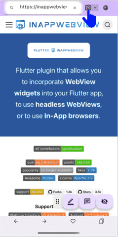

# Web Memory Sheet 使用指南

本页面简要介绍如何使用 **Web Memory Sheet** 应用。

## 什么是这款应用？

你是否熟悉学生常用的“红色遮盖纸”记忆法？  
就是用红色透明纸遮盖重点内容来测试记忆的方式。  
**Web Memory Sheet 将这种方法带到了手机上！**

你可以将教科书、笔记或教学网页转为数字记忆贴纸，一键搞定。

只需几次点击，就能用教学网站、教材照、笔记或黑板照片（请先征得老师许可）制作记忆贴纸。

下面，我们来看具体使用步骤。

## 目录

- [Web Memory Sheet 使用指南](#web-memory-sheet-使用指南)
  - [什么是这款应用？](#什么是这款应用)
  - [目录](#目录)
  - [使用前须知](#使用前须知)
    - [使用条款 \& 隐私政策](#使用条款--隐私政策)
    - [更改语言](#更改语言)
  - [操作步骤](#操作步骤)
    - [打开网页](#打开网页)
      - [输入网址](#输入网址)
      - [使用关键词搜索](#使用关键词搜索)
    - [使用照片](#使用照片)
      - [拍照](#拍照)
      - [选择图库照片](#选择图库照片)
    - [使用标记工具](#使用标记工具)
      - [添加标记](#添加标记)
      - [更改颜色与线条粗细](#更改颜色与线条粗细)
      - [删除标记](#删除标记)
      - [使用记忆模式](#使用记忆模式)
    - [添加备注](#添加备注)
      - [添加备注](#添加备注-1)
      - [查看 / 编辑 / 删除备注](#查看--编辑--删除备注)
    - [使用收藏](#使用收藏)
      - [添加到收藏](#添加到收藏)
      - [打开收藏](#打开收藏)
    - [移动图标面板](#移动图标面板)
      - [移动面板](#移动面板)

---

## 使用前须知

### 使用条款 & 隐私政策

首次启动应用时，需要您阅读并同意以下内容：

1. 打开 **使用条款**，滚动到末尾并打勾  
2. 打开 **隐私政策**，滚动到末尾并打勾  
3. 当两项均被勾选后，“同意”按钮将可点击  

之后，您即可开始使用应用。

> **注意**  
> 这些内容说明了使用规则以及对您设备信息的处理方式，请务必仔细阅读并同意使用。  
> （演示视频可能跳过阅读流程，但请确保您亲自查看！）  
> 您也可以通过以下链接查看详细内容：  
> [使用条款](./pp/privacyPolicy_zh.html)  
> [隐私政策](./ua/userAgreement_zh.html)

---

### 更改语言

1. 点击右上角的地球图标  
2. 选择您偏好的语言！  

*注：这不会影响外部网页的语言显示。*

---

## 操作步骤

### 打开网页

本应用支持像浏览器一样输入网址或搜索关键词来访问页面。

#### 输入网址

1. 点击地址栏  
2. 输入 URL  
3. 点击放大镜图标或按 Enter 键  

#### 使用关键词搜索

1. 点击地址栏  
2. 输入关键词  
3. 点击搜索结果中的链接  

> **警告**  
> 某些网页（如动画内容、PDF 文档或视频网站）可能不支持。

---

### 使用照片

除了网页内容，您还可以用手机拍照或图库照片学习。

#### 拍照

1. 点击地址栏旁的相机图标  
2. 点击 **相机** 图标  
3. 拍摄照片  
4. 照片将显示在屏幕上  
5. 使用左上角滑动条调整图片大小  

#### 选择图库照片

1. 点击同样的相机图标  
2. 点击 **照片** 图标  
3. 从设备中选择照片  
4. 使用左上角滑动条调整大小  

---

### 使用标记工具

展示网页或照片后，可开始遮盖你想隐藏的内容。

#### 添加标记

1. 点击底部的铅笔图标  
     
2. 用手指拖动覆盖想隐藏的区域  
   

#### 更改颜色与线条粗细

1. 点击铅笔图标  
2. 点击调色盘图标  
     
3. 设置面板中选择颜色和粗细：  
   - **颜色**：左侧选择  
   - **粗细**：右侧滑动条调整  
4. 点击“确定”完成设置  
   

#### 删除标记

1. 点击要删除的标记  
2. 标记被高亮后点击垃圾桶图标  
     
   

#### 使用记忆模式

1. 点击隐藏图标 → 标记变得不透明，覆盖内容  
     
2. 上划遮盖查看隐藏内容  
3. 点击标记可添加临时备注（记忆模式结束后会消失）  
4. 再次点击显示图标使标记变半透明  
     
   

---

### 添加备注

你也可以贴便签式备注！

#### 添加备注

1. 点击底部的备注图标  
     
2. 点击想添加备注的位置  
3. 选择颜色、输入内容 → 点击“确定”  
   

#### 查看 / 编辑 / 删除备注

1. 点击备注打开  
     
2. 更换颜色 → 点击色块图标  
     
3. 编辑内容 → 点击铅笔图标  
     
4. 删除备注 → 点击垃圾桶图标  
   

---

### 使用收藏

收藏带有标记或备注的页面，下次可自动恢复！

**一旦收藏，之后的标记与备注将自动保存。**

#### 添加到收藏

1. 点击底部的心形图标  
     
2. 选择文件夹、输入标题 → 点击 “添加”  
   

#### 打开收藏

1. 再次点击心形图标 → 弹出收藏列表  
     
2. 点击要打开的项目  
   

---

### 移动图标面板

右下角的图标面板可以自由拖动。  

#### 移动面板

1. 按住并拖动面板左侧  
2. 拖到目标位置后松开手指  
   
