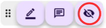
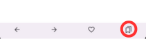

# Web Memory Sheet 使用指南

本頁面簡要介紹如何使用 **Web Memory Sheet** 應用程式。

## 這是什麼應用？

你是否熟悉學生常用的「紅色遮蓋紙」記憶法？  
就是用紅色透明紙遮蓋重點內容來測驗記憶的方式。  
**Web Memory Sheet 將這種方法帶到了手機上！**

你可以將教科書、筆記或教學網頁轉為數位記憶貼紙，一鍵完成。

只需幾下點擊，就能把教材照片、筆記或黑板（請先取得老師同意）等轉成記憶貼紙。

以下為具體操作步驟。

## 目錄

- [Web Memory Sheet 使用指南](#web-memory-sheet-使用指南)
  - [這是什麼應用？](#這是什麼應用)
  - [目錄](#目錄)
  - [使用前須知](#使用前須知)
    - [使用條款 \& 隱私政策](#使用條款--隱私政策)
    - [更改語言](#更改語言)
  - [操作指南](#操作指南)
    - [打開網頁](#打開網頁)
      - [輸入網址](#輸入網址)
      - [關鍵字搜尋](#關鍵字搜尋)
    - [使用照片](#使用照片)
      - [拍照使用](#拍照使用)
      - [使用已儲存照片](#使用已儲存照片)
    - [使用標記工具](#使用標記工具)
      - [添加標記](#添加標記)
      - [調整顏色與粗細](#調整顏色與粗細)
      - [刪除標記](#刪除標記)
      - [使用記憶模式](#使用記憶模式)
    - [添加備註](#添加備註)
      - [添加備註](#添加備註-1)
      - [查看 / 編輯 / 刪除備註](#查看--編輯--刪除備註)
    - [使用收藏](#使用收藏)
      - [新增收藏](#新增收藏)
      - [打開收藏](#打開收藏)
    - [移動圖示面板](#移動圖示面板)
      - [如何移動面板](#如何移動面板)

---

## 使用前須知

### 使用條款 & 隱私政策

首次啟動應用時，請閱讀並同意以下內容：

1. 開啟 **使用條款**，滑到最底並勾選  
2. 開啟 **隱私政策**，滑到最底並勾選  
3. 兩項皆勾選後，「同意」按鈕才會啟用

完成後，即可開始使用應用。

> **注意**  
> 這些文件說明了使用規則和如何處理從裝置收集的資料，請務必仔細閱讀並同意。  
> （示範影片可能略過閱讀，但請您務必逐條查看！）  
> 或可通過以下連結查看：  
> [使用條款](./pp/privacyPolicy_zh_TW.html)  
> [隱私政策](./ua/userAgreement_zh_TW.html)

---

### 更改語言

1. 點擊右上角的地球圖示  
2. 選擇您偏好的語言！  

*註：這不會影響網頁本身的語言顯示。*

---

## 操作指南

### 打開網頁

本應用如同瀏覽器一般，可輸入網址或使用關鍵字搜尋！

#### 輸入網址

1. 點擊網址列  
2. 輸入 URL  
3. 點選放大鏡或按 Enter 鍵  

#### 關鍵字搜尋

1. 點擊網址列  
2. 輸入搜尋詞  
3. 點擊搜尋結果  

> **警告**  
> 部分網頁（如動畫內容、PDF 文件或影片網站）可能不支援使用。

---

### 使用照片

除了網頁內容，您也可以使用手機拍照或相簿照片進行學習。

#### 拍照使用

1. 點選網址列旁的相機圖示  
2. 點擊 **拍照** 圖示  
3. 拍攝照片  
4. 照片會出現在螢幕上  
5. 使用左上方滑桿調整圖像大小  

#### 使用已儲存照片

1. 仍然點選相機圖示  
2. 點擊 **相簿** 圖示  
3. 從裝置選擇照片  
4. 使用左上方滑桿調整大小  

---

### 使用標記工具

顯示網頁或照片後，即可使用標記工具遮蓋重要內容。

#### 添加標記

1. 點擊底部的筆形圖示  
     
2. 用手指拖曳要遮蓋的區域  
   

#### 調整顏色與粗細

1. 點擊筆形圖示  
2. 點擊調色盤圖示  
     
3. 面板上調整參數：  
   - **顏色**：左側選擇  
   - **粗細**：右側滑桿調整  
4. 點擊「確定」完成設定  
   

#### 刪除標記

1. 點選欲刪除的標記  
2. 標記高亮後點擊垃圾桶圖示  
     
   

#### 使用記憶模式

1. 點擊「隱眼」圖示 → 標記變不透明並遮蓋內容  
     
2. 手指滑動可查看被遮內容  
3. 點擊標記可新增臨時備註（模式結束後消失）  
4. 點擊「顯眼」圖示 → 標記恢復半透明  
     
   

---

### 添加備註

您也可以貼上備註貼紙！

#### 添加備註

1. 點擊底部的備註圖示  
     
2. 點擊想貼備註的位置  
3. 選擇顏色、輸入備註內容 → 點擊「確定」  
   

#### 查看 / 編輯 / 刪除備註

1. 點擊備註以開啟  
     
2. 更換顏色 → 點擊色塊圖示  
     
3. 編輯內容 → 點擊筆形圖示  
     
4. 刪除備註 → 點擊垃圾桶圖示  
   

---

### 使用收藏

將帶有標記或備註的頁面加入收藏，下次可載入還原！

**一旦加入收藏，之後的標記與備註將自動保存。**

#### 新增收藏

1. 點擊底部的愛心圖示  
     
2. 選擇資料夾、輸入標題 → 點擊「新增」  
   

#### 打開收藏

1. 再次點擊愛心圖示 → 彈出收藏列表  
     
2. 點擊想開啟的項目  
   

---

### 移動圖示面板

右下角的圖示面板可以自由拖動。  

#### 如何移動面板

1. 按住並拖曳面板左側  
2. 拖到想放的位置後放開手指  
   
